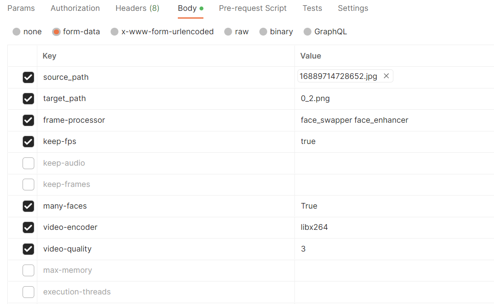
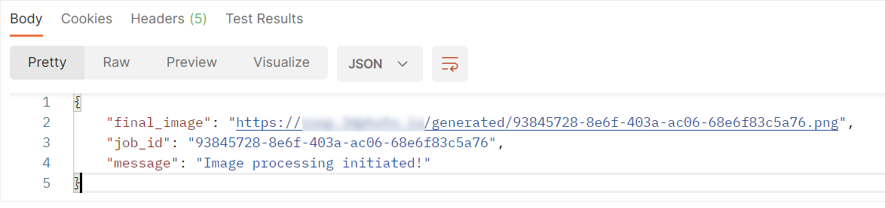

# Setting up the ROOP API.

First of all, you need ot have a working ROOP project. To access the project, visit the [ROOP GitHub repository](https://github.com/s0md3v/roop/).

## Why RabbitMQ for Job Processing?
RabbitMQ is a powerful message queuing system that offers several benefits for implementing job processing systems. It is particularly advantageous when handling computationally intensive tasks like face swapping. Here are the key reasons why RabbitMQ is an excellent choice:

1. Scalability: RabbitMQ enables the distribution of workload across multiple workers, making it easy to scale your job processing system. This ensures efficient handling of high volumes of requests without overwhelming the server.

2. Asynchronous Processing: With RabbitMQ, jobs can be processed asynchronously. Upon receiving a job request, RabbitMQ places it in a message queue, allowing the API to quickly respond to the caller while the actual job processing happens in the background. This asynchronous approach significantly enhances the performance and responsiveness of your API.

3. Reliability: RabbitMQ guarantees message delivery even in the face of failures. In case a worker goes offline or a server crashes, RabbitMQ ensures that messages are not lost and can be processed once the system is back online. This reliability is essential, especially for critical or time-sensitive job processing.

4. Load Balancing: RabbitMQ enables the even distribution of jobs across multiple workers, ensuring optimal workload balancing. By distributing tasks efficiently, RabbitMQ maximizes resource utilization and improves overall system efficiency.

5. Priority Queues: RabbitMQ supports priority queues, allowing you to assign different priorities to jobs. This feature is particularly useful for handling urgent or high-priority tasks, ensuring they are processed promptly.

## Prerequisites
- A server environment (e.g., Linux, Ubuntu)
- Python (version compatible with the required packages)
- Postman (or a similar API development tool for testing)

## 1. RabbitMQ Installation
- Refer to the official RabbitMQ documentation to install RabbitMQ on your Ubuntu server (RabbitMQ.md).. If you are using a different environment, please consult ChatGPT for assistance.

## 2. Configuration
- To get the code, use the command.  This command clones the repository into the api directory.

```git clone https://github.com/lvalics/roopapi.git api```

- Locate the `rconfig.py` file and fill in the necessary values. This configuration file contains the required settings for your RabbitMQ setup and folder structures.

## 3. Environment Setup
- Create an environment on your server and navigate to the project directory (you can try to use roop ENV as well).
- Install the project dependencies by running the command `pip install -r requirements.txt`. Note that some packages listed in `requirements.txt` may no longer be used. For example, the `cryptography` package is only required if you are using adhoc Flask.

## 4. Server Configuration
- Set up a domain or use a simple IP for your server. This guide assumes you are using Linux, specifically Ubuntu, for testing with RabbitMQ. However, it should work on other servers as well.

## 5. Running the Main App
- Execute the command `python rapp.py` to run the main application. This will start the API and make it ready to listen for requests.

## 6. Running the Worker Process
- Run the command `python rworker.py` to start the worker process responsible for handling jobs from RabbitMQ.
- Optionally, you can set up the worker process as a service. Normally, the worker process is configured to work only if `rapp.py` is running. However, it is recommended to test this setup to ensure it functions as expected.

## 7. Sending a Request
- Open Postman (or a similar tool) and make a POST request to `https://YOUR_URL/process`. Include the required parameters in the request body, as shown in the provided image.
- Send the request, and the job processing should commence successfully.




## Additional Notes
- Ensure that you have the "roop" package installed, as it is a prerequisite for this setup.
- Inside the "roop" package, you should have a folder named "api" with the required file structure. Make sure it is present.

## To-Do
- Authentication implementation and code cleaning are pending. These tasks will be addressed based on user feedback.

Please feel free to reach out if you have any questions or encounter any issues during the setup process.
